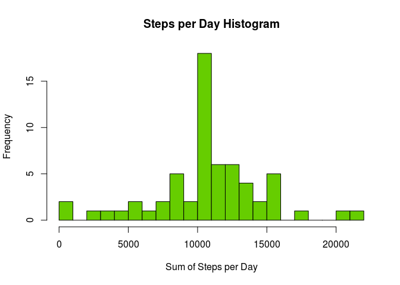

# *Data Analysis: Human Steps Recognition*

## Loading and preprocessing the data

* Reading from zipped file:

```r
data <- read.csv(unz("activity.zip","activity.csv"))
```
* Reformatting "date" variable to Date Format:

```r
data$date <- as.Date(data$date)
```

## What is mean total number of steps taken per day?

* Total number of steps taken per day:

```r
x <- aggregate(steps~date,data,sum)[,2]
```

* Histogram of total number of steps taken per day:

```r
hist(x,breaks=20,col = "aquamarine3",main = "Steps per Day Histogram",xlab = "Sum of Steps per Day")
```


* Mean of total number of steps per day: **10766.19**

```r
mean(x)
```

* Median of total number of steps per day: **10765**

```r
median(x)
```

## What is the average daily activity pattern?

* Average number of steps taken per interval:

```r
x <- aggregate(steps~interval,data,mean)
```

* Time series plot of the different intervals vs. average number of steps taken:

```r
plot(x$interval, x$steps, type="l", main = "Average daily activity pattern", xlab="5 min interval", ylab="Average steps taken")
```


* 5min interval with maximum number of steps (interval,steps): **(835, 206.169811320755)**

```r
x[x$steps==max(x$steps),]
```


## Imputing missing values

* Total number of NAs: **2304**

```r
sum(is.na(data$steps))
```

* Let's look at the number of NAs that appear each day:

```r
x <- aggregate(steps~date,data=data, function(y) {sum(is.na(y))}, na.action = NULL)
colnames(x) <- c("date","numberNAs")
```
* Let's just display the days that have more than 0 NAs:

```r
library(knitr)
kable(x[x$numberNAs>0,],format="markdown")
```


|   |date       | numberNAs|
|:--|:----------|---------:|
|1  |2012-10-01 |       288|
|8  |2012-10-08 |       288|
|32 |2012-11-01 |       288|
|35 |2012-11-04 |       288|
|40 |2012-11-09 |       288|
|41 |2012-11-10 |       288|
|45 |2012-11-14 |       288|
|61 |2012-11-30 |       288|

We can observe that NA values appear on full-day clusters, they're not randomly scattered across the dataset. It is on 8 specific dates where we're missing the entire monitoring data for the day.

I propose filling these empty days with the results from part 3, the average daily activity pattern. The average figures for each interval will be rounded to 0 decimals.

* Generating filled data for NA dates, filling in every interval observation with the average daily activity pattern:

```r
# Vector of average step values, previously calculated on part 3:
averageValSteps <- round(aggregate(steps~interval,data,mean)[,2])
# Vector of dates with missing data, displayed on the table above:
dates           <- x[x$numberNAs>0,1]
# Vector of different intervals:
intervals       <- unique(data$interval)
# Merging them all together:
filledData      <- as.data.frame(cbind(averageValSteps,intervals))
filledData      <- merge(filledData,dates)
filledData      <- filledData[,c(1,3,2)]
colnames(filledData) <- c("steps","date","interval")
```

* Binding filled data with the original uncomplete data:

```r
fullData <- rbind(data[!is.na(data$steps),],filledData)
fullData <- fullData[order(fullData$date),]
rownames(fullData) <- c(1:nrow(fullData))
```

* Histogram of total number of steps taken per day:

```r
x <- aggregate(steps~date,fullData,sum)[,2]
hist(x,breaks=20,col = "chartreuse3",main = "Steps per Day Histogram",xlab = "Sum of Steps per Day")
```



* Mean of total number of steps per day: **10765.64**

```r
mean(x)
```

* Median of total number of steps per day: **10762**

```r
median(x)
```

As spected, replacing missing values with average values brought mean and median closer to the total number of steps for a day with average values: **10762**

## Are there differences in activity patterns between weekdays and weekends?

* Creating factor vector from fullData, with 2 levels: "weekdays" & "weekends"

```r
x <- factor(weekdays(fullData[,2],abbreviate=TRUE))
levels(x) <- list(weekday=c("Mon","Tue","Wed","Thu","Fri"),weekend=c("Sat","Sun"))
```
* Adding column to fullData. 2 types of days: weekdays & weekends.

```r
fullData[,"day"] <- x
```
* Average number of steps taken per interval, per type of day:

```r
x <- aggregate(steps~interval+day,fullData,mean)
```
* Plotting using lattice:

```r
library(lattice)
xyplot(steps~interval|day,data=x,layout=c(1,2),type="l")
```


It is noticeable that weekdays have a distribution much more similar to the overall average of steps taken per interval, than weekends. It would have been something very important to consider when imputing the missing values on part 4.
